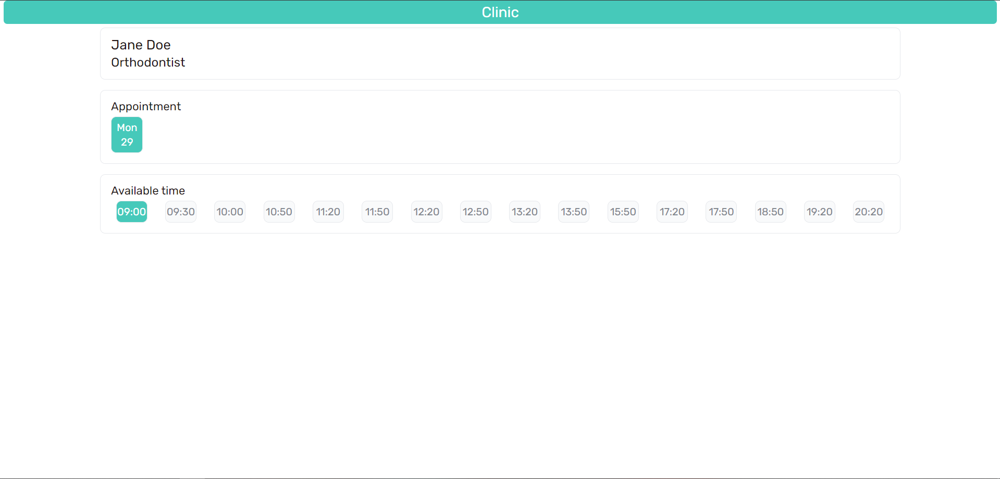
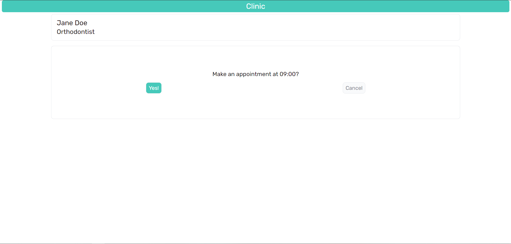
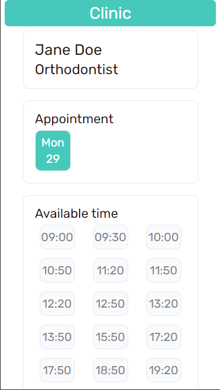
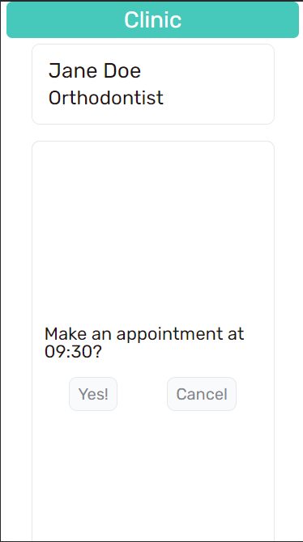

# Make an appointment

Hi! I'm Eva. Thank you for deciding to familiarize yourself with my solution to the test task.

## Table of contents

- [Overview](#overview)
  - [Test task](#test-task)
  - [Screenshot](#screenshot)
- [My process](#my-process)
  - [Built with](#built-with)
- [Author](#author)

## Overview

### Test task

"The doctor sees from 9 a.m. to 9 p.m.

A local file with busy time intervals is provided.

Based on the information received, it is required to create a list of free windows for 30 minutes.

P.S. The design of the UI is at your discretion".

**Additionally**, a fake appointment with a doctor has been implemented with the removal of the selected session from the free list and the addition of a busy interval in the store.

### Screenshot

Desktop:

  
  

Mobile:

  

    
    
  

## My process

### Built with

- React
- TypeScript
- Feature-Sliced Design (FSD architecture)
- Zustand
- SASS modules

## Author

- Frontend Mentor - [@GrigoryevaEva](https://www.frontendmentor.io/profile/GrigoryevaEva)
- GitHub - [@GrigoryevaEva](https://github.com/GrigoryevaEva)
